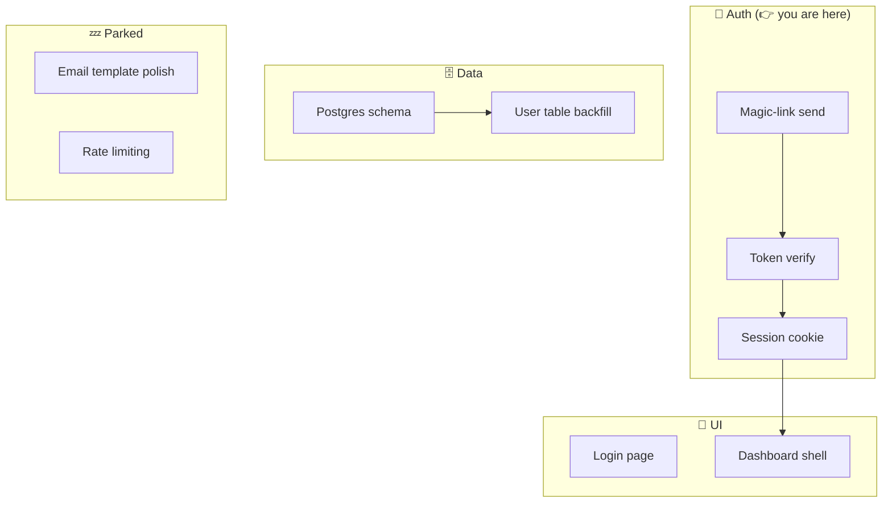

# Project Map: client-portal-rebuild
_Updated: 2026-05-23_

## One outcome (this session)
Get the magic-link login working end to end on the staging URL.

## The map

## Next 3 actions
1. Open `src/auth/sendLink.ts` — wire the SMTP call (token already generated). ~10 min.
2. Add the `/auth/verify` route that exchanges token for session cookie.
3. Point the login form at the new endpoint and test on staging.

## Parked
- 2026-05-23 Email template polish → UI
- 2026-05-23 Rate limiting on link requests → Auth
